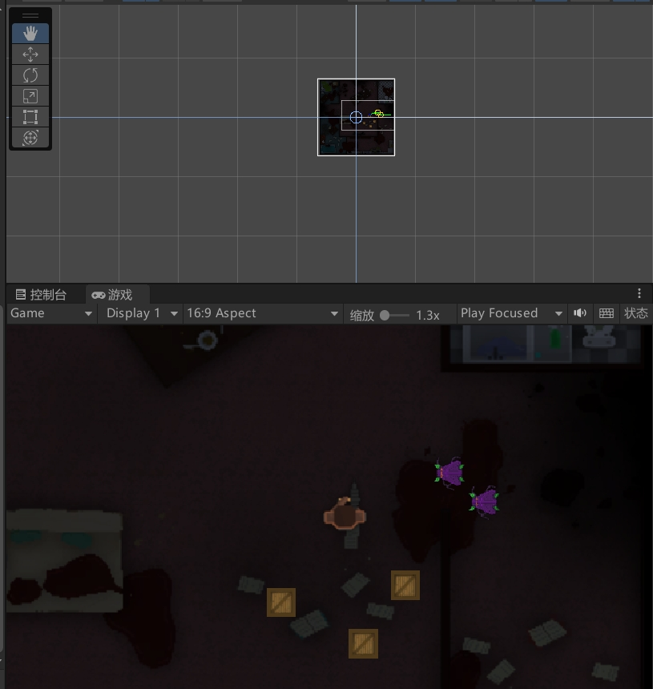

# Crazy Shoot 🎮🔥

欢迎来到 **Crazy Shoot**，这是一款基于 Unity 和 C# 开发的肾上腺素飙升的 2D 射击游戏！准备好进入一个充满激烈战斗、策略性玩法和无尽乐趣的世界吧！无论你是资深玩家还是休闲玩家，Crazy Shoot 都会让你欲罢不能！


) *(请替换为实际截图)*

## 🚀 功能亮点

- **快节奏战斗**：与敌人展开激烈战斗，考验你的反应速度和策略。
- **多种武器**：选择多种武器，每种武器都有独特的射击模式和能力。
- **动态敌人**：面对一波波敌人，它们会根据你的玩法进行调整。
- **炫酷视觉效果**：享受精美的 2D 图形和流畅的动画。
- **可自定义控制**：根据你的喜好调整控制方式，获得最佳游戏体验。
- **音效与音乐**：沉浸于史诗般的音效和音乐中，提升游戏体验。

## 🛠️ 技术栈

- **Unity**：驱动 Crazy Shoot 的游戏引擎。
- **C#**：用于游戏逻辑和机制的编程语言。
- **A* 寻路算法**：用于敌人移动和行为的 AI。
- **MIT 许可证**：开源且免费使用，可自由修改和分发。

## 📦 安装与运行

1. **克隆仓库**：
   ```bash
   git clone https://github.com/3034337688/Crazy-Shoot.git
   ```
2. **打开项目**：
   - 使用 Unity Hub 打开项目，确保 Unity 版本为 **2021.3 LTS** 或更高。
3. **运行游戏**：
   - 在 Unity 编辑器中打开 `Main` 场景，点击播放按钮即可开始游戏。

## 🎮 游戏玩法

- **移动**：使用 `WASD` 或方向键控制角色移动。
- **射击**：鼠标左键射击，右键切换武器。
- **换弹**：按下 `R` 键换弹。
- **躲避**：利用环境躲避敌人攻击，寻找最佳射击位置。

## 📜 许可证

本项目采用 **MIT 许可证**，详情请查看 [LICENSE](LICENSE) 文件。

## 🤝 贡献

欢迎贡献！如果你有任何想法或建议，请提交 Issue 或 Pull Request。让我们一起让 Crazy Shoot 变得更好！

## 🌟 炫酷标签


## 📞 联系

如果你有任何问题或建议，欢迎通过以下方式联系我：

- **GitHub**: [3034337688](https://github.com/3034337688)
- **Email**: [你的邮箱地址]

---

**准备好迎接挑战了吗？** 快来体验 Crazy Shoot，展现你的射击技巧吧！🎯💥
